# STYLAY E-Commerce API


A robust, scalable, and secure multi-vendor e-commerce API built with Node.js, Express, and MySQL. This API powers the STYLAY e-commerce platform, providing all the necessary endpoints for a modern online shopping experience with support for multiple vendors, advanced product variants, comprehensive order management, and enterprise-level features.

## 📋 Table of Contents

- [Features](#-features)
- [Technology Stack](#-technology-stack)
- [Project Structure](#-project-structure)
- [Prerequisites](#-prerequisites)
- [Installation](#-installation)
- [Configuration](#-configuration)
- [Database Schema](#-database-schema)
- [API Documentation](#-api-documentation)
- [Usage Examples](#-usage-examples)
- [Testing](#-testing)
- [Deployment](#-deployment)
- [Performance & Security](#-performance--security)
- [Troubleshooting](#-troubleshooting)
- [Contributing](#-contributing)
- [License](#-license)

## 🚀 Features

### Authentication & Authorization
- **JWT-based authentication** with secure token management
- **Role-based access control** (Admin, Vendor, Customer, Sub-Admin)
- **Email verification** system with secure tokens
- **Password reset functionality** with time-limited tokens
- **Phone number change** workflow with admin approval
- **Multi-factor authentication** ready architecture

### Product Management
- **CRUD operations** for products with comprehensive validation
- **Advanced variant system** supporting multiple variant types (Size, Color, Material, etc.)
- **Product categories and collections** with hierarchical organization
- **Product images and media** management with AWS S3 support
- **Product search and filtering** with advanced query capabilities
- **Inventory management** with real-time stock tracking
- **Product reviews and ratings** system
- **Recently viewed products** tracking with analytics

### Vendor Management
- **Vendor registration and onboarding** workflow
- **Business verification** with document upload
- **Vendor profiles** with branding and business information
- **Sales analytics** and performance tracking
- **Payout management** with automated calculations
- **Vendor follower** system for customer engagement

### Shopping Experience
- **Shopping cart** with persistent storage and variant support
- **Wishlist management** with priority levels and notes
- **Product reviews and ratings** with moderation
- **Related products** recommendation engine
- **Recently viewed** products tracking
- **Product comparison** capabilities

### Order Processing
- **Comprehensive checkout** process with address management
- **Order tracking** system with status updates
- **Order history** with detailed transaction logs
- **Payment integration** with Paystack and webhook support
- **Inventory reservation** and automatic stock updates
- **Order cancellation** and refund handling

### Administrative Features
- **Dashboard analytics** with real-time metrics
- **User management** with role assignment
- **Sub-admin system** with granular permissions
- **System monitoring** and performance tracking
- **Notification system** with email templates
- **Audit logging** for compliance and security

### Supply Chain Management
- **Supply tracking** from vendors to inventory
- **Bulk supply creation** with CSV import support
- **Inventory history** and change tracking
- **Low stock alerts** and automated notifications
- **Supply analytics** and vendor performance metrics

## 🛠 Technology Stack

### Core Technologies
- **Runtime:** Node.js (v14+)
- **Framework:** Express.js v4.21.2
- **Database:** MySQL 8.0+ with Sequelize ORM
- **Authentication:** JWT with Passport.js
- **Cache:** Redis for session management and caching
- **File Storage:** AWS S3 with local fallback

### Security & Performance
- **Security:** Helmet, CORS, Rate Limiting, XSS Protection
- **Validation:** Express Validator, Joi
- **Encryption:** bcryptjs for password hashing
- **Compression:** Gzip compression for API responses
- **Monitoring:** Winston logging, Prometheus metrics

### Development Tools
- **Testing:** Jest, Supertest for API testing
- **Linting:** ESLint with Airbnb configuration
- **Formatting:** Prettier code formatting
- **Process Management:** PM2 for production deployment
- **Database:** Sequelize CLI for migrations and seeding

### Payment & External Services
- **Payment Gateway:** Paystack integration
- **Email Service:** Nodemailer with template support
- **File Upload:** Multer with S3 support
- **Tunneling:** Ngrok for local development

## 📁 Project Structure

```
stylay-api/
├── app.js                      # Main application entry point
├── ecosystem.config.js         # PM2 configuration
├── .env.example               # Environment variables template
├── package.json               # Dependencies and scripts
├── README.md                  # Project documentation
│
├── config/                    # Configuration files
│   ├── config.js             # Database and app configuration
│   ├── database.js           # Sequelize database setup
│   ├── passport.js           # Passport authentication config
│   ├── permission.js         # Role-based permissions
│   ├── redis.js              # Redis configuration
│   └── storage.js            # File storage configuration
│
├── controllers/              # Request handlers
│   ├── auth.controller.js    # Authentication endpoints
│   ├── user.controller.js    # User management
│   ├── vendor.controller.js  # Vendor operations
│   ├── product.controller.js # Product management
│   ├── order.controller.js   # Order processing
│   ├── cart.controller.js    # Shopping cart
│   ├── wishlist.controller.js# Wishlist management
│   ├── inventory.controller.js# Inventory tracking
│   ├── review.controller.js  # Product reviews
│   ├── category.controller.js# Product categories
│   ├── collection.controller.js# Product collections
│   ├── supply.controller.js  # Supply chain management
│   ├── dashboard.controller.js# Analytics dashboard
│   ├── variant.controller.js # Product variants
│   ├── address.controller.js # Address management
│   ├── journal.controller.js # System journals
│   ├── webhook.controller.js # Webhook handlers
│   ├── role.controller.js    # Role management
│   └── subadmin.controller.js# Sub-admin management
│
├── models/                   # Database models
│   ├── user.model.js         # User model
│   ├── vendor.model.js       # Vendor model
│   ├── product.model.js      # Product model
│   ├── order.model.js        # Order model
│   ├── order-item.model.js   # Order items
│   ├── order-detail.model.js # Order details
│   ├── cart.model.js         # Shopping cart
│   ├── cart-item.model.js    # Cart items
│   ├── wishlist.model.js     # Wishlist
│   ├── wishlist-item.model.js# Wishlist items
│   ├── inventory.model.js    # Inventory tracking
│   ├── supply.model.js       # Supply management
│   ├── category.model.js     # Product categories
│   ├── collection.model.js   # Product collections
│   ├── review.model.js       # Product reviews
│   ├── variant-type.model.js # Variant types
│   ├── variant-combination.model.js# Variant combinations
│   ├── product-variant.model.js# Legacy variant support
│   ├── address.model.js      # User addresses
│   ├── role.model.js         # User roles
│   ├── permission.model.js   # System permissions
│   ├── notification.model.js # System notifications
│   ├── payment-transaction.model.js# Payment tracking
│   └── index.js              # Model associations
│
├── routes/                   # API route definitions
│   ├── auth.route.js         # Authentication routes
│   ├── user.route.js         # User management routes
│   ├── vendor.route.js       # Vendor routes
│   ├── product.route.js      # Product routes
│   ├── order.route.js        # Order routes
│   ├── cart.route.js         # Cart routes
│   ├── wishlist.route.js     # Wishlist routes
│   ├── inventory.route.js    # Inventory routes
│   ├── review.route.js       # Review routes
│   ├── category.route.js     # Category routes
│   ├── collection.route.js   # Collection routes
│   ├── supply.route.js       # Supply routes
│   ├── dashboard.route.js    # Dashboard routes
│   ├── variant.route.js      # Variant routes
│   ├── address.route.js      # Address routes
│   ├── journal.route.js      # Journal routes
│   ├── webhook.route.js      # Webhook routes
│   ├── role.route.js         # Role routes
│   └── admin/                # Admin-specific routes
│       ├── index.js          # Admin route initialization
│       ├── dashboard.route.js# Admin dashboard
│       ├── product.route.js  # Admin product management
│       ├── order.route.js    # Admin order management
│       └── subadmin.route.js # Sub-admin management
│
├── middlewares/              # Custom middleware
│   ├── auth.js               # Authentication middleware
│   ├── validation.js         # Request validation
│   ├── checkPermission.js    # Permission checking
│   ├── fileUpload.js         # File upload handling
│   ├── upload.js             # Upload middleware
│   ├── error.js              # Error handling
│   └── vendorOnboarding.js   # Vendor onboarding
│
├── migrations/               # Database migrations
│   ├── 20250823010000-create-roles.js
│   ├── 20250823020000-create-stores.js
│   ├── 20250823030000-create-users.js
│   ├── 20250823040000-create-categories.js
│   ├── 20250823050000-create-collections.js
│   ├── 20250823060000-create-user-roles.js
│   ├── 20250823070000-create-vendors.js
│   ├── 20250823080000-create-products.js
│   ├── 20250823090000-create-supply.js
│   ├── 20250823100000-create-inventory.js
│   ├── 20250823110000-create-journals.js
│   ├── 20250823120000-create-reviews.js
│   ├── 20250823150000-create-addresses.js
│   ├── 20250823160000-create-orders.js
│   ├── 20250823170000-create-order-items.js
│   ├── 20250823180000-create-order-details.js
│   ├── 20250823200000-create-payment-transactions.js
│   ├── 20250823210000-create-payouts.js
│   ├── 20250823220000-create-notifications.js
│   ├── 20250823230000-create-notification-items.js
│   ├── 20250824000000-add-payment-fields-to-orders.js
│   ├── 20250919100000-create-carts.js
│   ├── 20250919110000-create-cart-items.js
│   ├── 20250923143500-create-wishlists.js
│   ├── 20251028102627-create-variant-types.js
│   ├── 20251028102734-create-variant-combinations.js
│   ├── 20251108000000-create-user-product-views.js
│   └── 20251109000001-update-wishlist-variants-and-totals.js
│
├── seeders/                  # Database seeders
│   ├── 20250823010000-seed-default-roles.js
│   ├── 20250823020000-seed-permissions.js
│   ├── 20250824000000-seed-admin-user.js
│   ├── 20250824030000-seed-customers.js
│   ├── 20250825000000-seed-vendors.js
│   ├── 20250826000000-seed-categories.js
│   ├── 20250827000000-seed-variant-types.js
│   ├── 20250828000000-seed-products.js
│   ├── 20250829010000-seed-supplies.js
│   ├── 20250830000000-seed-journals.js
│   ├── 20250831000000-seed-addresses.js
│   ├── 20250901000000-seed-orders.js
│   ├── 20250902000000-seed-reviews.js
│   └── 20251108000000-add-missing-permissions.js
│
├── services/                 # Business logic services
│   ├── email.service.js      # Email service
│   ├── payment.service.js    # Payment processing
│   ├── permission.service.js # Permission management
│   ├── recentlyViewed.service.js# Recently viewed products
│   └── variant.service.js    # Variant management
│
├── utils/                    # Utility functions
│   ├── logger.js             # Logging utility
│   ├── cache.js              # Caching utilities
│   ├── fileUpload.js         # File upload helpers
│   ├── fileUtils.js          # File utilities
│   ├── appError.js           # Custom error classes
│   ├── catchAsync.js         # Async error handling
│   └── performance.js        # Performance monitoring
│
├── validators/               # Request validation schemas
│   ├── auth.validator.js     # Auth validation
│   ├── user.validator.js     # User validation
│   ├── vendor.validator.js   # Vendor validation
│   ├── product.validator.js  # Product validation
│   ├── order.validator.js    # Order validation
│   ├── cart.validator.js     # Cart validation
│   ├── wishlist.validator.js # Wishlist validation
│   ├── address.validator.js  # Address validation
│   ├── category.validator.js # Category validation
│   ├── collection.validator.js# Collection validation
│   ├── supply.validator.js   # Supply validation
│   ├── review.validator.js   # Review validation
│   ├── role.validator.js     # Role validation
│   ├── subadmin.validator.js # Sub-admin validation
│   └── journal.validator.js  # Journal validation
│
├── views/                    # Email templates
│   └── emails/               # EJS email templates
│       ├── welcome.ejs       # Welcome email
│       ├── password-reset.ejs# Password reset
│       ├── order-confirmation.ejs# Order confirmation
│       ├── order-shipped.ejs # Order shipped
│       ├── order-delivered.ejs# Order delivered
│       ├── order-cancelled.ejs# Order cancelled
│       ├── payment-received.ejs# Payment received
│       ├── payment-failed.ejs# Payment failed
│       ├── vendor-approved.ejs# Vendor approved
│       ├── vendor-rejected.ejs# Vendor rejected
│       ├── vendor-order.ejs  # Vendor order notification
│       ├── admin-phone-change-request.ejs# Phone change
│       ├── phone-change.ejs  # Phone change notification
│       └── subadmin-created.ejs# Sub-admin created
│
├── public/                   # Static files
│   ├── logo.png              # Application logo
│   └── Upload/               # File uploads
│       └── vendor-assets/    # Vendor uploaded files
│
├── test/                     # Test files
│   ├── enhanced-wishlist.test.js# Wishlist tests
│   ├── recentlyViewed.test.js# Recently viewed tests
│   ├── redis-cache-test.js   # Redis cache tests
│   └── test-checkPermission.js# Permission tests
│
├── scripts/                  # Utility scripts
│   └── convert-legacy-wishlist-data.js# Data migration
│
├── docs/                     # Documentation
│   ├── enhanced-wish.md      # Enhanced wishlist docs
│   ├── model-relationships.md# Database relationships
│   ├── performance-optimization.md# Performance guide
│   ├── recently-viewed-products-api.md# Recent products API
│   └── variant-system-api.md # Variant system docs
│
└── postman/                  # API testing
    └── Stylay-API-Updated.postman_collection.json# Postman collection
```

## 📦 Prerequisites

### System Requirements
- **Node.js:** v14.0.0 or higher
- **MySQL:** v8.0 or higher
- **npm:** v7.x or higher (or yarn v1.22+)
- **Redis:** v6.0 or higher
- **Git:** Latest version

### Optional Dependencies
- **PM2:** For production process management
- **AWS S3:** For file storage (configurable)
- **Ngrok:** For local development tunneling
- **Docker:** For containerized deployment

### Platform Support
- **Operating Systems:** Linux, macOS, Windows 10+
- **Cloud Platforms:** AWS, Google Cloud, Azure, DigitalOcean
- **Database:** MySQL 8.0+, MariaDB 10.5+

## 🚀 Installation

### 1. Clone the Repository

```bash
git clone https://github.com/K-Lanre/stylay-api.git
cd stylay-api
```

### 2. Install Dependencies

```bash
# Install all dependencies
npm install

# Or using yarn
yarn install
```

### 3. Database Setup

#### Install MySQL (if not already installed)

**Ubuntu/Debian:**
```bash
sudo apt update
sudo apt install mysql-server
sudo mysql_secure_installation
```

**macOS (using Homebrew):**
```bash
brew install mysql
brew services start mysql
```

**Windows:**
Download and install from [MySQL official website](https://dev.mysql.com/downloads/mysql/)

#### Create Database

```sql
mysql -u root -p
CREATE DATABASE stylay_db CHARACTER SET utf8mb4 COLLATE utf8mb4_unicode_ci;
CREATE USER 'stylay_user'@'localhost' IDENTIFIED BY 'your_secure_password';
GRANT ALL PRIVILEGES ON stylay_db.* TO 'stylay_user'@'localhost';
FLUSH PRIVILEGES;
EXIT;
```

### 4. Redis Setup

**Ubuntu/Debian:**
```bash
sudo apt update
sudo apt install redis-server
sudo systemctl enable redis-server
sudo systemctl start redis-server
```

**macOS:**
```bash
brew install redis
brew services start redis
```

**Verify Redis is running:**
```bash
redis-cli ping
# Should return: PONG
```

### 5. Environment Configuration

```bash
# Copy the example environment file
cp .env.example .env

# Edit the environment file
nano .env
```

### 6. Database Migration and Seeding

```bash
# Run migrations
npm run migrate

# Seed the database with initial data
npm run seed

# Or run both commands
npm run setup
```

### 7. Start the Application

#### Development Mode
```bash
# Using nodemon for auto-restart
npm run dev

# Or using the basic start command
npm start
```

#### Production Mode
```bash
# Using PM2
npm run pm2:start

# Check PM2 status
pm2 status
pm2 logs stylay-api
```

The application will be available at:
- **Development:** `http://localhost:3001`
- **Production:** `http://localhost:3000` (or your configured port)

## ⚙️ Configuration

### Environment Variables

Create a `.env` file in the root directory with the following variables:

#### Server Configuration
```env
# Application settings
NODE_ENV=development
PORT=3000
APP_NAME=Stylay

# CORS configuration
CORS_ORIGIN=http://localhost:3001
FRONTEND_URL=http://localhost:5173
ADMIN_URL=http://localhost:3001/admin
VENDOR_PORTAL_URL=http://localhost:3001/vendor
```

#### Database Configuration
```env
# MySQL database settings
DB_HOST=localhost
DB_PORT=3306
DB_NAME=stylay_db
DB_USER=stylay_user
DB_PASSWORD=your_secure_password
DB_DIALECT=mysql
```

#### Authentication & Security
```env
# JWT configuration
JWT_SECRET=your_very_secure_jwt_secret_key_here
JWT_EXPIRES_IN=90d
JWT_COOKIE_EXPIRES_IN=90

# Session security
SESSION_SECRET=your_session_secret_here
PASSWORD_RESET_EXPIRES=30

# Rate limiting
RATE_LIMIT_WINDOW_MS=3600000
RATE_LIMIT_MAX=1000
```

#### Email Configuration
```env
# SMTP email settings
EMAIL_HOST=smtp.gmail.com
EMAIL_PORT=587
EMAIL_SECURE=false
EMAIL_USER=your_email@gmail.com
EMAIL_PASS=your_app_specific_password
EMAIL_FROM=noreply@stylay.com
EMAIL_FROM_NAME=Stylay Team
SUPPORT_EMAIL=support@stylay.com
```

#### Payment Configuration (Paystack)
```env
# Paystack payment gateway
PAYSTACK_SECRET_KEY=sk_test_your_paystack_secret_key
PAYSTACK_PUBLIC_KEY=pk_test_your_paystack_public_key
PAYSTACK_BASE_URL=https://api.paystack.co
PAYSTACK_WEBHOOK_SECRET=your_webhook_secret
PAYSTACK_WEBHOOK_URL=http://yourdomain.com/api/v1/webhooks/paystack
PAYSTACK_CALLBACK_URL=http://yourdomain.com/api/orders/verify
```

#### Redis Configuration
```env
# Redis settings
REDIS_HOST=localhost
REDIS_PORT=6379
REDIS_PASSWORD=
```

#### AWS S3 Configuration (Optional)
```env
# AWS S3 for file storage
AWS_ACCESS_KEY_ID=your_aws_access_key
AWS_SECRET_ACCESS_KEY=your_aws_secret_key
AWS_REGION=us-east-1
AWS_BUCKET_NAME=stylay-uploads
```

#### Default User Passwords (Development)
```env
# Default passwords for seeded users
DEFAULT_VENDOR_PASSWORD=Vendor@123
DEFAULT_CUSTOMER_PASSWORD=Customer@123
DEFAULT_ADMIN_PASSWORD=Admin@123
DEFAULT_SUBADMIN_PASSWORD=SecurePass123!
```

### Configuration Files

#### PM2 Ecosystem Configuration (`ecosystem.config.js`)
```javascript
module.exports = {
  apps: [
    {
      name: 'stylay-api',
      script: 'app.js',
      instances: 'max',
      exec_mode: 'cluster',
      env: {
        NODE_ENV: 'development',
        PORT: 3001
      },
      env_production: {
        NODE_ENV: 'production',
        PORT: 3000
      },
      error_file: './logs/err.log',
      out_file: './logs/out.log',
      log_file: './logs/combined.log',
      time: true
    }
  ]
};
```

## 🗄️ Database Schema

### Core Entity Relationship Diagram

```mermaid
erDiagram
    Users ||--o{ Orders : places
    Users ||--o{ Addresses : has
    Users ||--o{ Carts : owns
    Users ||--o{ Wishlists : has
    Users ||--o{ Reviews : writes
    Users ||--o{ Notifications : receives
    Users }|--|| Roles : has
    Users ||--o{ VendorFollowers : follows
    
    Vendors ||--o{ Products : sells
    Vendors ||--o{ Supplies : provides
    Vendors ||--o{ Payouts : receives
    Vendors ||--o{ VendorProductTags : creates
    
    Products ||--o{ ProductImages : has
    Products ||--o{ ProductVariants : has
    Products ||--o{ VariantCombinations : has
    Products ||--o{ Reviews : receives
    Products }|--|| Categories : belongs_to
    Products ||--o{ CollectionProducts : in_collections
    Products ||--o{ Supply : supplied_by
    Products ||--o{ Inventory : tracked_in
    Products ||--o{ OrderItems : ordered_in
    Products ||--o{ CartItems : added_to
    Products ||--o{ WishlistItems : wished_for
    Products ||--o{ UserProductViews : viewed_by
    
    Orders ||--o{ OrderItems : contains
    Orders ||--o{ OrderDetails : has
    Orders ||--o{ PaymentTransactions : paid_with
    Orders ||--o{ Notifications : generates
    
    Categories ||--o{ Products : categorizes
    Categories ||--o{ CollectionProducts : in_collections
    
    Collections ||--o{ CollectionProducts : contains
    
    VariantTypes ||--o{ VariantCombinationVariants : defines
    VariantCombinations ||--o{ VariantCombinationVariants : composed_of
    VariantCombinations ||--o{ Inventory : tracked_in
    VariantCombinations ||--o{ Supply : supplied_as
    
    Roles ||--o{ UserRoles : assigned_to
    Roles ||--o{ RolePermissions : has
    Permissions ||--o{ RolePermissions : granted_by
```



### Key Database Models

#### User Management
- **Users:** Core user accounts with authentication
- **Roles:** System roles (Admin, Vendor, Customer)
- **Permissions:** Granular permission system
- **UserRoles:** User-role assignments
- **RolePermissions:** Role-permission mappings

#### Product System
- **Products:** Core product information
- **Categories:** Product categorization
- **Collections:** Product groupings
- **ProductImages:** Media attachments
- **VariantTypes:** Variant categories (Size, Color, etc.)
- **VariantCombinations:** Specific product variations
- **ProductVariants:** Legacy variant support

#### E-commerce Core
- **Orders:** Purchase orders
- **OrderItems:** Individual order line items
- **OrderDetails:** Order additional information
- **Carts:** Shopping carts
- **CartItems:** Cart line items
- **Wishlists:** User wishlists
- **WishlistItems:** Wishlist line items

#### Inventory & Supply
- **Inventory:** Stock level tracking
- **Supply:** Vendor supply records
- **InventoryHistory:** Stock change history
- **VendorProductTags:** Product categorization by vendors

#### Payment & Analytics
- **PaymentTransactions:** Payment processing records
- **Payouts:** Vendor payments
- **Notifications:** System notifications
- **Reviews:** Product reviews and ratings

### Database Migrations

The application uses Sequelize migrations for schema management:

```bash
# Run pending migrations
npm run migrate

# Create a new migration
npx sequelize-cli migration:generate --name migration_name

# Rollback last migration
npm run migrate:undo

# Rollback all migrations
npm run migrate:undo:all

# Seed database
npm run seed

# Create a new seeder
npx sequelize-cli seed:generate --name seeder_name
```

## 📡 API Documentation

The Stylay API provides comprehensive endpoints for all e-commerce functionality. All endpoints are prefixed with `/api/v1/`.

### Authentication Endpoints

#### User Registration
```http
POST /api/v1/auth/register
Content-Type: application/json

{
  "first_name": "John",
  "last_name": "Doe", 
  "email": "john@example.com",
  "password": "SecurePassword123!",
  "phone": "+2348012345678",
  "gender": "male"
}
```

#### User Login
```http
POST /api/v1/auth/login
Content-Type: application/json

{
  "email": "john@example.com",
  "password": "SecurePassword123!"
}
```

**Response:**
```json
{
  "status": "success",
  "token": "jwt_token_here",
  "user": {
    "id": 1,
    "first_name": "John",
    "last_name": "Doe",
    "email": "john@example.com",
    "role": "customer"
  }
}
```

#### Email Verification
```http
POST /api/v1/auth/verify-email
Content-Type: application/json

{
  "email": "john@example.com",
  "code": "123456"
}
```

#### Password Reset
```http
# Request reset
POST /api/v1/auth/forgot-password
Content-Type: application/json

{
  "email": "john@example.com"
}

# Reset with token
POST /api/v1/auth/reset-password
Content-Type: application/json

{
  "email": "john@example.com",
  "code": "123456",
  "password": "NewPassword123!"
}
```

### Product Management

#### Get All Products
```http
GET /api/v1/products?page=1&limit=20&category=electronics&search=laptop
Authorization: Bearer {token}
```

#### Create Product (Vendor/Admin)
```http
POST /api/v1/products
Authorization: Bearer {token}
Content-Type: multipart/form-data

{
  "name": "Laptop Computer",
  "description": "High-performance laptop",
  "price": 999.99,
  "category_id": 1,
  "status": "active",
  "images": [file1, file2]
}
```

#### Get Product by ID
```http
GET /api/v1/products/123
```

#### Update Product
```http
PUT /api/v1/products/123
Authorization: Bearer {token}
Content-Type: application/json

{
  "name": "Updated Laptop Name",
  "price": 899.99,
  "status": "active"
}
```

#### Get Product Variants
```http
GET /api/v1/products/123/variants
```

#### Create Variant Combination
```http
POST /api/v1/variants/combinations
Authorization: Bearer {token}
Content-Type: application/json

{
  "product_id": 123,
  "variants": {
    "Color": "Black",
    "Size": "Large"
  },
  "sku": "LAPTOP-BLACK-L",
  "price": 999.99,
  "stock": 50
}
```

### Cart Management

#### Get User Cart
```http
GET /api/v1/cart
Authorization: Bearer {token}
```

#### Add Item to Cart
```http
POST /api/v1/cart/items
Authorization: Bearer {token}
Content-Type: application/json

{
  "product_id": 123,
  "variant_id": 456,
  "quantity": 2,
  "notes": "Gift wrap needed"
}
```

#### Update Cart Item
```http
PUT /api/v1/cart/items/789
Authorization: Bearer {token}
Content-Type: application/json

{
  "quantity": 3,
  "notes": "Updated notes"
}
```

#### Remove Cart Item
```http
DELETE /api/v1/cart/items/789
Authorization: Bearer {token}
```

### Wishlist Management

#### Get User Wishlist
```http
GET /api/v1/wishlists/123
Authorization: Bearer {token}
```

#### Add Item to Wishlist
```http
POST /api/v1/wishlists/123/items
Authorization: Bearer {token}
Content-Type: application/json

{
  "product_id": 123,
  "variant_id": 456,
  "quantity": 1,
  "priority": "high",
  "notes": "Birthday gift"
}
```

#### Enhanced Wishlist (Multiple Variants)
```http
POST /api/v1/wishlists/123/items
Authorization: Bearer {token}
Content-Type: application/json

{
  "product_id": 123,
  "selected_variants": [
    {
      "id": 456,
      "name": "Color",
      "value": "Red",
      "additional_price": 5.00
    },
    {
      "id": 789,
      "name": "Size", 
      "value": "L",
      "additional_price": 0.00
    }
  ],
  "quantity": 2,
  "priority": "high"
}
```

### Order Management

#### Create Order
```http
POST /api/v1/orders
Authorization: Bearer {token}
Content-Type: application/json

{
  "cart_id": 456,
  "shipping_address_id": 789,
  "billing_address_id": 789,
  "payment_method": "card",
  "notes": "Leave at front door"
}
```

#### Get User Orders
```http
GET /api/v1/orders/my-orders?page=1&limit=10
Authorization: Bearer {token}
```

#### Get Order Details
```http
GET /api/v1/orders/123
Authorization: Bearer {token}
```

#### Cancel Order
```http
PATCH /api/v1/orders/123/cancel
Authorization: Bearer {token}
Content-Type: application/json

{
  "reason": "Changed my mind"
}
```

### Payment Processing

#### Initialize Payment
```http
POST /api/v1/orders/123/pay
Authorization: Bearer {token}
Content-Type: application/json

{
  "payment_method": "card",
  "callback_url": "https://yourapp.com/payment/callback"
}
```

#### Verify Payment
```http
GET /api/v1/orders/verify-payment/{reference}
Authorization: Bearer {token}
```

#### Payment Webhook
```http
POST /api/v1/webhooks/paystack
Content-Type: application/json
X-Paystack-Signature: {webhook_signature}

// Paystack webhook payload
{
  "event": "charge.success",
  "data": {
    "reference": "payment_reference",
    "amount": 50000,
    "status": "success"
  }
}
```

### Inventory Management

#### Get Inventory
```http
GET /api/v1/inventory?page=1&limit=20
Authorization: Bearer {token}
```

#### Update Stock
```http
PATCH /api/v1/inventory/123/stock
Authorization: Bearer {token}
Content-Type: application/json

{
  "quantity": 75,
  "reason": "Restock"
}
```

#### Get Inventory History
```http
GET /api/v1/inventory/history/123
Authorization: Bearer {token}
```

### Review System

#### Get Product Reviews
```http
GET /api/v1/reviews?product_id=123&page=1&limit=10
```

#### Create Review
```http
POST /api/v1/reviews
Authorization: Bearer {token}
Content-Type: application/json

{
  "product_id": 123,
  "rating": 5,
  "title": "Excellent product!",
  "comment": "Great quality and fast delivery."
}
```

#### Update Review
```http
PUT /api/v1/reviews/456
Authorization: Bearer {token}
Content-Type: application/json

{
  "rating": 4,
  "title": "Updated review",
  "comment": "Still good but had some issues."
}
```

### Recently Viewed Products

#### Get Recently Viewed
```http
GET /api/v1/products/recent?limit=10
Authorization: Bearer {token}
```

#### Get View Statistics
```http
GET /api/v1/products/recent/stats
Authorization: Bearer {token}
```

#### Clear View History
```http
DELETE /api/v1/products/recent
Authorization: Bearer {token}
```

### Vendor Management

#### Register as Vendor
```http
POST /api/v1/vendors/register
Content-Type: application/json

{
  "first_name": "John",
  "last_name": "Vendor",
  "email": "vendor@example.com",
  "phone": "+2348012345678",
  "business_name": "John's Store",
  "cac_number": "RC123456",
  "join_reason": "I want to sell my products"
}
```

#### Get Vendor Profile
```http
GET /api/v1/vendors/vendor/profile
Authorization: Bearer {vendor_token}
```

#### Complete Vendor Onboarding
```http
PATCH /api/v1/vendors/vendor/onboarding
Authorization: Bearer {vendor_token}
Content-Type: multipart/form-data

{
  "logo": [file],
  "business_images": [file1, file2],
  "bank_account_name": "John's Store",
  "bank_account_number": "1234567890",
  "bank_name": "First Bank"
}
```

#### Get Vendor Orders
```http
GET /api/v1/orders/vendor/orders?page=1&limit=20
Authorization: Bearer {vendor_token}
```

### Admin Dashboard

#### Get Dashboard Statistics
```http
GET /api/v1/admin/dashboard/stats
Authorization: Bearer {admin_token}
```

#### Get Sales Analytics
```http
GET /api/v1/admin/dashboard/sales-stats?year=2024&month=11
Authorization: Bearer {admin_token}
```

#### Get Top Categories
```http
GET /api/v1/admin/dashboard/top-categories?limit=10
Authorization: Bearer {admin_token}
```

#### Get Recent Orders
```http
GET /api/v1/admin/dashboard/recent-orders?page=1&limit=10
Authorization: Bearer {admin_token}
```

### User Management (Admin)

#### Get All Users
```http
GET /api/v1/users?page=1&limit=20&search=john
Authorization: Bearer {admin_token}
```

#### Create User
```http
POST /api/v1/users
Authorization: Bearer {admin_token}
Content-Type: application/json

{
  "first_name": "Jane",
  "last_name": "Doe",
  "email": "jane@example.com",
  "password": "Password123!",
  "phone": "+2348012345679",
  "role_ids": [2, 3]
}
```

#### Update User
```http
PATCH /api/v1/users/123
Authorization: Bearer {admin_token}
Content-Type: application/json

{
  "first_name": "Jane Updated",
  "phone": "+2348012345670",
  "is_active": true,
  "role_ids": [2, 3]
}
```

### Sub-Admin Management

#### Create Sub-Admin
```http
POST /api/v1/admin/subadmins
Authorization: Bearer {admin_token}
Content-Type: application/json

{
  "first_name": "John",
  "last_name": "Manager",
  "email": "manager@stylay.com",
  "password": "SecurePass123!",
  "permission_groups": ["vendor_management", "products_management"]
}
```

#### Get All Sub-Admins
```http
GET /api/v1/admin/subadmins?page=1&limit=10&search=john
Authorization: Bearer {admin_token}
```

#### Update Sub-Admin Permissions
```http
PATCH /api/v1/admin/subadmins/123/permissions
Authorization: Bearer {admin_token}
Content-Type: application/json

{
  "permission_groups": ["earnings_payment", "feedbacks_support"]
}
```

### System Health

#### Health Check
```http
GET /health
```

#### Metrics Endpoint (Prometheus)
```http
GET /metrics
```

## 💻 Usage Examples

### Authentication Flow

#### Complete User Registration and Login Flow

```javascript
// 1. Register a new user
const registerResponse = await fetch('/api/v1/auth/register', {
  method: 'POST',
  headers: { 'Content-Type': 'application/json' },
  body: JSON.stringify({
    first_name: 'John',
    last_name: 'Doe',
    email: 'john@example.com',
    password: 'SecurePassword123!',
    phone: '+2348012345678',
    gender: 'male'
  })
});

const { token, user } = await registerResponse.json();

// 2. Use token for authenticated requests
const authHeaders = {
  'Authorization': `Bearer ${token}`,
  'Content-Type': 'application/json'
};

// 3. Update user profile
const updateResponse = await fetch('/api/v1/auth/me', {
  method: 'PUT',
  headers: authHeaders,
  body: JSON.stringify({
    first_name: 'John Updated',
    last_name: 'Doe',
    phone: '+2348012345679'
  })
});

// 4. Get current user
const meResponse = await fetch('/api/v1/auth/me', {
  headers: authHeaders
});
const currentUser = await meResponse.json();
```

#### Password Reset Flow

```javascript
// 1. Request password reset
const forgotResponse = await fetch('/api/v1/auth/forgot-password', {
  method: 'POST',
  headers: { 'Content-Type': 'application/json' },
  body: JSON.stringify({ email: 'john@example.com' })
});

// 2. User clicks email link and enters code
const resetResponse = await fetch('/api/v1/auth/reset-password', {
  method: 'POST',
  headers: { 'Content-Type': 'application/json' },
  body: JSON.stringify({
    email: 'john@example.com',
    code: '123456',
    password: 'NewPassword123!'
  })
});

// 3. Login with new password
const loginResponse = await fetch('/api/v1/auth/login', {
  method: 'POST',
  headers: { 'Content-Type': 'application/json' },
  body: JSON.stringify({
    email: 'john@example.com',
    password: 'NewPassword123!'
  })
});
const { token } = await loginResponse.json();
```

### Product Management Examples

#### Working with Products and Variants

```javascript
// 1. Create a product with variants
const productResponse = await fetch('/api/v1/products', {
  method: 'POST',
  headers: {
    'Authorization': `Bearer ${vendorToken}`,
    'Content-Type': 'multipart/form-data'
  },
  body: productFormData // FormData with files
});

const product = await productResponse.json();

// 2. Create variant types
const variantTypeResponse = await fetch('/api/v1/variants/types', {
  method: 'POST',
  headers: {
    'Authorization': `Bearer ${vendorToken}`,
    'Content-Type': 'application/json'
  },
  body: JSON.stringify({
    name: 'Size',
    values: ['Small', 'Medium', 'Large', 'XL']
  })
});

// 3. Create variant combinations
const combinationResponse = await fetch('/api/v1/variants/combinations', {
  method: 'POST',
  headers: {
    'Authorization': `Bearer ${vendorToken}`,
    'Content-Type': 'application/json'
  },
  body: JSON.stringify({
    product_id: product.id,
    variants: { 'Color': 'Red', 'Size': 'Large' },
    sku: 'TSHIRT-RED-L',
    price: 29.99,
    stock: 50
  })
});

// 4. Update combination stock
const stockResponse = await fetch('/api/v1/variants/combinations/123/stock', {
  method: 'PATCH',
  headers: {
    'Authorization': `Bearer ${vendorToken}`,
    'Content-Type': 'application/json'
  },
  body: JSON.stringify({ stock: 75 })
});
```

### Shopping Cart and Checkout

#### Complete Shopping Flow

```javascript
// 1. Add items to cart
const addToCartResponse = await fetch('/api/v1/cart/items', {
  method: 'POST',
  headers: {
    'Authorization': `Bearer ${customerToken}`,
    'Content-Type': 'application/json'
  },
  body: JSON.stringify({
    product_id: 123,
    variant_id: 456,
    quantity: 2,
    notes: 'Gift wrap needed'
  })
});

const cartItem = await addToCartResponse.json();

// 2. Update cart item
const updateResponse = await fetch('/api/v1/cart/items/789', {
  method: 'PUT',
  headers: {
    'Authorization': `Bearer ${customerToken}`,
    'Content-Type': 'application/json'
  },
  body: JSON.stringify({ quantity: 3 })
});

// 3. Get cart contents
const cartResponse = await fetch('/api/v1/cart', {
  headers: { 'Authorization': `Bearer ${customerToken}` }
});
const cart = await cartResponse.json();

// 4. Create order from cart
const orderResponse = await fetch('/api/v1/orders', {
  method: 'POST',
  headers: {
    'Authorization': `Bearer ${customerToken}`,
    'Content-Type': 'application/json'
  },
  body: JSON.stringify({
    cart_id: cart.id,
    shipping_address_id: 456,
    payment_method: 'card'
  })
});

const order = await orderResponse.json();

// 5. Process payment
const paymentResponse = await fetch(`/api/v1/orders/${order.id}/pay`, {
  method: 'POST',
  headers: {
    'Authorization': `Bearer ${customerToken}`,
    'Content-Type': 'application/json'
  },
  body: JSON.stringify({
    payment_method: 'card',
    callback_url: 'https://yourapp.com/payment/callback'
  })
});
```

### Wishlist Management

#### Enhanced Wishlist with Multiple Variants

```javascript
// 1. Create wishlist
const wishlistResponse = await fetch('/api/v1/wishlists', {
  method: 'POST',
  headers: {
    'Authorization': `Bearer ${customerToken}`,
    'Content-Type': 'application/json'
  },
  body: JSON.stringify({ name: 'Birthday Wishlist' })
});

const wishlist = await wishlistResponse.json();

// 2. Add item with multiple variants
const wishlistItemResponse = await fetch(`/api/v1/wishlists/${wishlist.id}/items`, {
  method: 'POST',
  headers: {
    'Authorization': `Bearer ${customerToken}`,
    'Content-Type': 'application/json'
  },
  body: JSON.stringify({
    product_id: 123,
    selected_variants: [
      {
        id: 456,
        name: 'Color',
        value: 'Red',
        additional_price: 5.00
      },
      {
        id: 789,
        name: 'Size',
        value: 'L',
        additional_price: 0.00
      }
    ],
    quantity: 2,
    priority: 'high',
    notes: 'Birthday gift for sister'
  })
});

const wishlistItem = await wishlistItemResponse.json();

// 3. Get wishlist with totals
const getWishlistResponse = await fetch(`/api/v1/wishlists/${wishlist.id}`, {
  headers: { 'Authorization': `Bearer ${customerToken}` }
});
const updatedWishlist = await getWishlistResponse.json();

console.log('Total items:', updatedWishlist.total_items);
console.log('Total amount:', updatedWishlist.total_amount);

// 4. Update wishlist item
const updateWishlistResponse = await fetch(
  `/api/v1/wishlists/${wishlist.id}/items/${wishlistItem.id}`,
  {
    method: 'PUT',
    headers: {
      'Authorization': `Bearer ${customerToken}`,
      'Content-Type': 'application/json'
    },
    body: JSON.stringify({ quantity: 3, priority: 'medium' })
  }
);
```

### Vendor Operations

#### Complete Vendor Onboarding and Management

```javascript
// 1. Register as vendor
const vendorRegisterResponse = await fetch('/api/v1/vendors/register', {
  method: 'POST',
  headers: { 'Content-Type': 'application/json' },
  body: JSON.stringify({
    first_name: 'John',
    last_name: 'Store Owner',
    email: 'vendor@example.com',
    business_name: "John's Electronics",
    cac_number: 'RC123456',
    join_reason: 'I want to sell electronics online'
  })
});

const vendorProfile = await vendorRegisterResponse.json();

// 2. Complete onboarding (after approval)
const onboardingFormData = new FormData();
onboardingFormData.append('logo', logoFile);
onboardingFormData.append('business_images', businessImage1);
onboardingFormData.append('bank_account_name', "John's Electronics");
onboardingFormData.append('bank_account_number', '1234567890');

const onboardingResponse = await fetch('/api/v1/vendors/vendor/onboarding', {
  method: 'PATCH',
  headers: {
    'Authorization': `Bearer ${vendorToken}`
  },
  body: onboardingFormData
});

// 3. Get vendor dashboard
const dashboardResponse = await fetch('/api/v1/dashboard/vendor', {
  headers: { 'Authorization': `Bearer ${vendorToken}` }
});
const dashboard = await dashboardResponse.json();

// 4. Get vendor orders
const ordersResponse = await fetch('/api/v1/orders/vendor/orders?page=1', {
  headers: { 'Authorization': `Bearer ${vendorToken}` }
});
const orders = await ordersResponse.json();

// 5. Update order item status
const statusResponse = await fetch(`/api/v1/orders/items/123/status`, {
  method: 'PATCH',
  headers: {
    'Authorization': `Bearer ${vendorToken}`,
    'Content-Type': 'application/json'
  },
  body: JSON.stringify({ status: 'shipped' })
});
```

### Admin Operations

#### Comprehensive Admin Dashboard

```javascript
// 1. Get overall statistics
const statsResponse = await fetch('/api/v1/admin/dashboard/stats', {
  headers: { 'Authorization': `Bearer ${adminToken}` }
});
const stats = await statsResponse.json();

console.log('Total users:', stats.total_users);
console.log('Total orders:', stats.total_orders);
console.log('Total revenue:', stats.total_revenue);

// 2. Get sales analytics
const salesResponse = await fetch('/api/v1/admin/dashboard/sales-stats?year=2024', {
  headers: { 'Authorization': `Bearer ${adminToken}` }
});
const sales = await salesResponse.json();

// 3. Get top performing categories
const categoriesResponse = await fetch('/api/v1/admin/dashboard/top-categories?limit=10', {
  headers: { 'Authorization': `Bearer ${adminToken}` }
});
const categories = await categoriesResponse.json();

// 4. Get recent orders
const recentOrdersResponse = await fetch('/api/v1/admin/dashboard/recent-orders?page=1&limit=20', {
  headers: { 'Authorization': `Bearer ${adminToken}` }
});
const recentOrders = await recentOrdersResponse.json();

// 5. Manage vendors
const vendorsResponse = await fetch('/api/v1/admin/dashboard/vendor-overview?page=1', {
  headers: { 'Authorization': `Bearer ${adminToken}` }
});
const vendors = await vendorsResponse.json();

// 6. Create sub-admin
const subAdminResponse = await fetch('/api/v1/admin/subadmins', {
  method: 'POST',
  headers: {
    'Authorization': `Bearer ${adminToken}`,
    'Content-Type': 'application/json'
  },
  body: JSON.stringify({
    first_name: 'Jane',
    last_name: 'Manager',
    email: 'jane.manager@stylay.com',
    password: 'SecurePass123!',
    permission_groups: ['vendor_management', 'products_management']
  })
});
```

### Error Handling Examples

#### Comprehensive Error Handling

```javascript
// Generic API call with error handling
async function apiCall(url, options = {}) {
  try {
    const response = await fetch(url, {
      headers: {
        'Content-Type': 'application/json',
        ...options.headers
      },
      ...options
    });

    const data = await response.json();

    if (!response.ok) {
      throw new Error(data.message || `HTTP ${response.status}`);
    }

    return data;
  } catch (error) {
    console.error('API Error:', error);
    throw error;
  }
}

// Usage with error handling
try {
  const product = await apiCall('/api/v1/products/123', {
    headers: { 'Authorization': `Bearer ${token}` }
  });
  console.log('Product:', product);
} catch (error) {
  if (error.message.includes('404')) {
    console.log('Product not found');
  } else if (error.message.includes('401')) {
    console.log('Unauthorized - please login');
  } else {
    console.log('Error:', error.message);
  }
}

// Specific error handling for validation
async function createProduct(productData) {
  try {
    const response = await apiCall('/api/v1/products', {
      method: 'POST',
      headers: { 'Authorization': `Bearer ${token}` },
      body: JSON.stringify(productData)
    });
    return response;
  } catch (error) {
    if (error.message.includes('validation')) {
      console.log('Validation errors:', error.details);
    }
    throw error;
  }
}
```

### File Upload Examples

#### Uploading Product Images

```javascript
// Upload product images
async function uploadProductImages(productId, imageFiles) {
  const formData = new FormData();
  
  // Add product data
  formData.append('name', 'New Product');
  formData.append('description', 'Product description');
  formData.append('price', '99.99');
  formData.append('category_id', '1');
  
  // Add multiple image files
  imageFiles.forEach((file, index) => {
    formData.append('images', file);
  });

  try {
    const response = await fetch('/api/v1/products', {
      method: 'POST',
      headers: {
        'Authorization': `Bearer ${token}`
        // Don't set Content-Type for FormData
      },
      body: formData
    });

    const result = await response.json();
    
    if (!response.ok) {
      throw new Error(result.message);
    }

    return result;
  } catch (error) {
    console.error('Upload failed:', error);
    throw error;
  }
}

// Usage
const fileInput = document.getElementById('imageFiles');
const files = Array.from(fileInput.files);

uploadProductImages(productId, files)
  .then(result => {
    console.log('Product created:', result);
  })
  .catch(error => {
    console.error('Error:', error.message);
  });
```

## 🧪 Testing

### Running Tests

The project includes comprehensive test suites using Jest and Supertest.

#### Execute All Tests
```bash
# Run all tests
npm test

# Run tests in watch mode
npm run test:watch

# Run tests with coverage
npm run test:coverage
```

#### Run Specific Test Files
```bash
# Test enhanced wishlist functionality
npm test test/enhanced-wishlist.test.js

# Test recently viewed products
npm test test/recentlyViewed.test.js

# Test Redis caching
npm test test/redis-cache-test.js

# Test permission system
npm test test/test-checkPermission.js
```

### Test Structure

#### Test Configuration (`package.json`)
```json
{
  "scripts": {
    "test": "jest --watchAll --verbose --coverage",
    "test:watch": "jest --watch",
    "test:coverage": "jest --coverage"
  },
  "jest": {
    "testEnvironment": "node",
    "collectCoverageFrom": [
      "**/*.js",
      "!**/node_modules/**",
      "!**/logs/**",
      "!ecosystem.config.js"
    ],
    "coverageDirectory": "coverage",
    "coverageReporters": ["text", "lcov", "html"]
  }
}
```

#### Sample Test File

```javascript
// test/enhanced-wishlist.test.js
const request = require('supertest');
const app = require('../app');
const { sequelize } = require('../config/database');

describe('Enhanced Wishlist API', () => {
  let authToken;
  let wishlistId;

  beforeAll(async () => {
    // Setup test database
    await sequelize.sync({ force: true });
    
    // Create test user and get token
    const userResponse = await request(app)
      .post('/api/v1/auth/register')
      .send({
        first_name: 'Test',
        last_name: 'User',
        email: 'test@example.com',
        password: 'TestPassword123!',
        phone: '+2348012345678'
      });

    authToken = userResponse.body.token;
  });

  afterAll(async () => {
    // Cleanup
    await sequelize.close();
  });

  describe('POST /api/v1/wishlists/:id/items', () => {
    test('should add item with multiple variants', async () => {
      // Create wishlist first
      const wishlistResponse = await request(app)
        .post('/api/v1/wishlists')
        .set('Authorization', `Bearer ${authToken}`)
        .send({ name: 'Test Wishlist' });

      wishlistId = wishlistResponse.body.data.id;

      // Add item with multiple variants
      const response = await request(app)
        .post(`/api/v1/wishlists/${wishlistId}/items`)
        .set('Authorization', `Bearer ${authToken}`)
        .send({
          product_id: 1,
          selected_variants: [
            {
              id: 1,
              name: 'Color',
              value: 'Red',
              additional_price: 5.00
            },
            {
              id: 2,
              name: 'Size',
              value: 'L',
              additional_price: 0.00
            }
          ],
          quantity: 2,
          priority: 'high',
          notes: 'Test item'
        });

      expect(response.status).toBe(201);
      expect(response.body.status).toBe('success');
      expect(response.body.data.selected_variants).toHaveLength(2);
      expect(response.body.data.total_price).toBeGreaterThan(0);
    });

    test('should calculate total price correctly', async () => {
      const response = await request(app)
        .post(`/api/v1/wishlists/${wishlistId}/items`)
        .set('Authorization', `Bearer ${authToken}`)
        .send({
          product_id: 2,
          selected_variants: [
            {
              id: 3,
              name: 'Color',
              value: 'Blue',
              additional_price: 10.00
            }
          ],
          quantity: 1
        });

      expect(response.body.data.total_price).toBe(39.99); // 29.99 + 10.00
    });

    test('should reject invalid variant combinations', async () => {
      const response = await request(app)
        .post(`/api/v1/wishlists/${wishlistId}/items`)
        .set('Authorization', `Bearer ${authToken}`)
        .send({
          product_id: 1,
          selected_variants: [
            {
              id: 999, // Non-existent variant
              name: 'Color',
              value: 'Invalid',
              additional_price: 0
            }
          ],
          quantity: 1
        });

      expect(response.status).toBe(400);
      expect(response.body.message).toContain('not found');
    });
  });

  describe('GET /api/v1/wishlists/:id', () => {
    test('should return wishlist with calculated totals', async () => {
      const response = await request(app)
        .get(`/api/v1/wishlists/${wishlistId}`)
        .set('Authorization', `Bearer ${authToken}`);

      expect(response.status).toBe(200);
      expect(response.body.data.total_items).toBeGreaterThan(0);
      expect(response.body.data.total_amount).toBeGreaterThan(0);
      expect(response.body.data.items).toHaveLength(2);
    });
  });

  describe('PUT /api/v1/wishlists/:id/items/:itemId', () => {
    test('should update wishlist item and recalculate totals', async () => {
      // Get wishlist items first
      const itemsResponse = await request(app)
        .get(`/api/v1/wishlists/${wishlistId}/items`)
        .set('Authorization', `Bearer ${authToken}`);

      const itemId = itemsResponse.body.data[0].id;

      // Update item
      const response = await request(app)
        .put(`/api/v1/wishlists/${wishlistId}/items/${itemId}`)
        .set('Authorization', `Bearer ${authToken}`)
        .send({
          quantity: 3,
          priority: 'medium',
          notes: 'Updated test item'
        });

      expect(response.status).toBe(200);
      expect(response.body.data.quantity).toBe(3);
      expect(response.body.data.priority).toBe('medium');
    });
  });
});
```

#### Test Database Setup

```javascript
// test/setup.js
const { sequelize } = require('../config/database');

beforeAll(async () => {
  // Create test database if it doesn't exist
  const testDbName = process.env.DB_NAME_TEST || 'stylay_db_test';
  
  // Force sync for testing
  await sequelize.sync({ force: true });
});

afterAll(async () => {
  // Close database connection
  await sequelize.close();
});
```

#### Environment for Tests

```env
# .env.test
NODE_ENV=test
DB_NAME_TEST=stylay_db_test
DB_USER=test_user
DB_PASSWORD=test_password
JWT_SECRET=test_jwt_secret
EMAIL_HOST=localhost
EMAIL_PORT=1025
REDIS_HOST=localhost
REDIS_PORT=6379
```

#### API Integration Tests

```javascript
// test/product.test.js
const request = require('supertest');
const app = require('../app');

describe('Product API Integration', () => {
  let vendorToken;
  let adminToken;
  let productId;

  beforeAll(async () => {
    // Setup authentication tokens
    const vendorResponse = await request(app)
      .post('/api/v1/auth/login')
      .send({
        email: 'vendor@example.com',
        password: 'Vendor@123'
      });
    vendorToken = vendorResponse.body.token;

    const adminResponse = await request(app)
      .post('/api/v1/auth/login')
      .send({
        email: 'admin@stylay.com',
        password: 'Admin@123'
      });
    adminToken = adminResponse.body.token;
  });

  test('GET /api/v1/products - should return paginated products', async () => {
    const response = await request(app)
      .get('/api/v1/products?page=1&limit=10')
      .set('Authorization', `Bearer ${adminToken}`);

    expect(response.status).toBe(200);
    expect(response.body.data).toBeInstanceOf(Array);
    expect(response.body.pagination).toBeDefined();
  });

  test('POST /api/v1/products - should create new product', async () => {
    const productData = {
      name: 'Test Product',
      description: 'Test product description',
      price: 99.99,
      category_id: 1,
      status: 'active'
    };

    const response = await request(app)
      .post('/api/v1/products')
      .set('Authorization', `Bearer ${vendorToken}`)
      .send(productData);

    expect(response.status).toBe(201);
    expect(response.body.data.name).toBe(productData.name);
    productId = response.body.data.id;
  });

  test('PUT /api/v1/products/:id - should update product', async () => {
    const updateData = {
      name: 'Updated Product Name',
      price: 89.99
    };

    const response = await request(app)
      .put(`/api/v1/products/${productId}`)
      .set('Authorization', `Bearer ${vendorToken}`)
      .send(updateData);

    expect(response.status).toBe(200);
    expect(response.body.data.name).toBe(updateData.name);
    expect(response.body.data.price).toBe(updateData.price);
  });

  test('DELETE /api/v1/products/:id - should delete product', async () => {
    const response = await request(app)
      .delete(`/api/v1/products/${productId}`)
      .set('Authorization', `Bearer ${vendorToken}`);

    expect(response.status).toBe(200);
    expect(response.body.message).toContain('deleted successfully');
  });
});
```

## 🚀 Deployment

### Production Deployment with PM2

#### 1. Environment Setup

```bash
# Create production environment file
cp .env.example .env.production

# Edit production environment
nano .env.production
```

#### Production Environment Variables

```env
# Production settings
NODE_ENV=production
PORT=3000
APP_NAME=Stylay

# Production database
DB_HOST=your-production-db-host
DB_PORT=3306
DB_NAME=stylay_production
DB_USER=stylay_prod_user
DB_PASSWORD=your_production_password

# Production JWT secret (use a strong, unique secret)
JWT_SECRET=your_very_secure_production_jwt_secret_key_here

# Production CORS
CORS_ORIGIN=https://yourdomain.com
FRONTEND_URL=https://yourfrontend.com
ADMIN_URL=https://youradmin.com
VENDOR_PORTAL_URL=https://yourvendor.com

# Production email settings
EMAIL_HOST=smtp.sendgrid.net
EMAIL_PORT=587
EMAIL_USER=apikey
EMAIL_PASS=your_sendgrid_api_key
EMAIL_FROM=noreply@yourdomain.com

# Production Redis
REDIS_HOST=your-redis-host
REDIS_PORT=6379
REDIS_PASSWORD=your_redis_password

# Production AWS S3
AWS_ACCESS_KEY_ID=your_production_aws_key
AWS_SECRET_ACCESS_KEY=your_production_aws_secret
AWS_REGION=us-east-1
AWS_BUCKET_NAME=stylay-production

# Production Paystack
PAYSTACK_SECRET_KEY=sk_live_your_live_secret_key
PAYSTACK_PUBLIC_KEY=pk_live_your_live_public_key
PAYSTACK_WEBHOOK_URL=https://yourdomain.com/api/v1/webhooks/paystack
```

#### 2. PM2 Ecosystem Configuration

```javascript
// ecosystem.config.js
module.exports = {
  apps: [
    {
      name: 'stylay-api',
      script: 'app.js',
      instances: 'max',
      exec_mode: 'cluster',
      env: {
        NODE_ENV: 'development',
        PORT: 3001
      },
      env_production: {
        NODE_ENV: 'production',
        PORT: 3000
      },
      error_file: './logs/err.log',
      out_file: './logs/out.log',
      log_file: './logs/combined.log',
      time: true,
      max_memory_restart: '1G',
      node_args: '--max-old-space-size=1024',
      watch: false,
      ignore_watch: ['node_modules', 'logs', 'public/Upload'],
      restart_delay: 4000,
      max_restarts: 10,
      min_uptime: '10s',
      kill_timeout: 5000,
      listen_timeout: 3000,
      shutdown_with_message: true,
      autorestart: true,
      vizion: true
    }
  ],
  
  deploy: {
    production: {
      user: 'ubuntu',
      host: 'your-server.com',
      ref: 'origin/main',
      repo: 'https://github.com/K-Lanre/stylay-api.git',
      path: '/var/www/stylay-api',
      'post-deploy': 'npm install && npm run migrate && npm run pm2:start',
      'pre-setup': 'apt update && apt install git -y'
    }
  }
};
```

#### 3. Deploy to Production

```bash
# Install PM2 globally
npm install -g pm2

# Install dependencies
npm install --production

# Run database migrations
npm run migrate

# Start with PM2
pm2 start ecosystem.config.js --env production

# Save PM2 configuration
pm2 save

# Setup PM2 to start on system boot
pm2 startup

# Monitor application
pm2 monit

# View logs
pm2 logs stylay-api

# Restart application
pm2 restart stylay-api

# Stop application
pm2 stop stylay-api
```

### Docker Deployment

#### Dockerfile

```dockerfile
# Use Node.js 16 Alpine image
FROM node:16-alpine

# Set working directory
WORKDIR /app

# Copy package files
COPY package*.json ./

# Install dependencies
RUN npm ci --only=production && npm cache clean --force

# Copy source code
COPY . .

# Create logs directory
RUN mkdir -p logs

# Expose port
EXPOSE 3000

# Create non-root user
RUN addgroup -g 1001 -S nodejs
RUN adduser -S stylay -u 1001

# Change ownership of the app directory
RUN chown -R stylay:nodejs /app
USER stylay

# Health check
HEALTHCHECK --interval=30s --timeout=3s --start-period=5s --retries=3 \
  CMD node healthcheck.js

# Start the application
CMD ["npm", "start"]
```

#### Docker Compose

```yaml
# docker-compose.yml
version: '3.8'

services:
  stylay-api:
    build: .
    ports:
      - "3000:3000"
    environment:
      - NODE_ENV=production
      - DB_HOST=mysql
      - REDIS_HOST=redis
    depends_on:
      - mysql
      - redis
    volumes:
      - ./logs:/app/logs
      - ./uploads:/app/public/Upload
    networks:
      - stylay-network
    restart: unless-stopped

  mysql:
    image: mysql:8.0
    environment:
      - MYSQL_ROOT_PASSWORD=rootpassword
      - MYSQL_DATABASE=stylay_production
      - MYSQL_USER=stylay_user
      - MYSQL_PASSWORD=stylay_password
    ports:
      - "3306:3306"
    volumes:
      - mysql_data:/var/lib/mysql
      - ./mysql/init.sql:/docker-entrypoint-initdb.d/init.sql
    networks:
      - stylay-network
    restart: unless-stopped

  redis:
    image: redis:6-alpine
    ports:
      - "6379:6379"
    volumes:
      - redis_data:/data
    networks:
      - stylay-network
    restart: unless-stopped

  nginx:
    image: nginx:alpine
    ports:
      - "80:80"
      - "443:443"
    volumes:
      - ./nginx/nginx.conf:/etc/nginx/nginx.conf
      - ./nginx/ssl:/etc/nginx/ssl
    depends_on:
      - stylay-api
    networks:
      - stylay-network
    restart: unless-stopped

volumes:
  mysql_data:
  redis_data:

networks:
  stylay-network:
    driver: bridge
```

#### Build and Run with Docker

```bash
# Build the image
docker build -t stylay-api .

# Run with Docker Compose
docker-compose up -d

# View logs
docker-compose logs -f stylay-api

# Scale the application
docker-compose up -d --scale stylay-api=3

# Stop services
docker-compose down
```

### Cloud Deployment

#### AWS Deployment

```bash
# Install AWS CLI
aws configure

# Create ECS task definition
aws ecs register-task-definition --cli-input-json file://aws-task-definition.json

# Create service
aws ecs create-service \
  --cluster stylay-cluster \
  --service-name stylay-api \
  --task-definition stylay-api:1 \
  --desired-count 2
```

#### Google Cloud Platform

```bash
# Install gcloud CLI
gcloud auth login
gcloud config set project your-project-id

# Build and push image
gcloud builds submit --tag gcr.io/your-project-id/stylay-api

# Deploy to Cloud Run
gcloud run deploy stylay-api \
  --image gcr.io/your-project-id/stylay-api \
  --platform managed \
  --region us-central1 \
  --allow-unauthenticated
```

### Load Balancer Configuration

#### Nginx Configuration

```nginx
# /etc/nginx/sites-available/stylay-api
upstream stylay_backend {
    server localhost:3000;
    server localhost:3001;
    server localhost:3002;
}

server {
    listen 80;
    server_name api.yourdomain.com;

    # Redirect HTTP to HTTPS
    return 301 https://$server_name$request_uri;
}

server {
    listen 443 ssl http2;
    server_name api.yourdomain.com;

    # SSL Configuration
    ssl_certificate /etc/ssl/certs/yourdomain.crt;
    ssl_certificate_key /etc/ssl/private/yourdomain.key;
    ssl_protocols TLSv1.2 TLSv1.3;
    ssl_ciphers ECDHE-RSA-AES256-GCM-SHA512:DHE-RSA-AES256-GCM-SHA512;

    # Security Headers
    add_header X-Frame-Options "SAMEORIGIN" always;
    add_header X-Content-Type-Options "nosniff" always;
    add_header X-XSS-Protection "1; mode=block" always;

    # Rate limiting
    limit_req_zone $binary_remote_addr zone=api:10m rate=100r/m;

    # API routes
    location /api/ {
        limit_req zone=api burst=20 nodelay;
        
        proxy_pass http://stylay_backend;
        proxy_http_version 1.1;
        proxy_set_header Upgrade $http_upgrade;
        proxy_set_header Connection 'upgrade';
        proxy_set_header Host $host;
        proxy_set_header X-Real-IP $remote_addr;
        proxy_set_header X-Forwarded-For $proxy_add_x_forwarded_for;
        proxy_set_header X-Forwarded-Proto $scheme;
        proxy_cache_bypass $http_upgrade;
        
        # Timeouts
        proxy_connect_timeout 60s;
        proxy_send_timeout 60s;
        proxy_read_timeout 60s;
    }

    # Health check endpoint
    location /health {
        proxy_pass http://stylay_backend;
        access_log off;
    }

    # Static files
    location /uploads/ {
        alias /var/www/stylay-api/public/Upload/;
        expires 1y;
        add_header Cache-Control "public, immutable";
    }
}
```

### Monitoring and Logging

#### Log Configuration

```javascript
// utils/logger.js
const winston = require('winston');
const path = require('path');

const logger = winston.createLogger({
  level: process.env.LOG_LEVEL || 'info',
  format: winston.format.combine(
    winston.format.timestamp({
      format: 'YYYY-MM-DD HH:mm:ss'
    }),
    winston.format.errors({ stack: true }),
    winston.format.json()
  ),
  defaultMeta: { service: 'stylay-api' },
  transports: [
    // Write all logs with level 'error' and below to error.log
    new winston.transports.File({
      filename: path.join(__dirname, '../logs/error.log'),
      level: 'error',
      maxsize: 5242880, // 5MB
      maxFiles: 5
    }),
    // Write all logs with level 'info' and below to combined.log
    new winston.transports.File({
      filename: path.join(__dirname, '../logs/combined.log'),
      maxsize: 5242880, // 5MB
      maxFiles: 5
    })
  ]
});

// If we're not in production, log to the console with a simple format
if (process.env.NODE_ENV !== 'production') {
  logger.add(new winston.transports.Console({
    format: winston.format.combine(
      winston.format.colorize(),
      winston.format.simple()
    )
  }));
}

module.exports = logger;
```

#### Health Check Endpoint

```javascript
// Health check implementation
app.get('/health', async (req, res) => {
  const healthCheck = {
    uptime: process.uptime(),
    message: 'OK',
    timestamp: Date.now(),
    checks: {
      database: false,
      redis: false
    }
  };

  try {
    // Check database connection
    await sequelize.authenticate();
    healthCheck.checks.database = true;
  } catch (error) {
    healthCheck.checks.database = false;
    healthCheck.message = 'Database connection failed';
  }

  try {
    // Check Redis connection
    if (redisClient && redisClient.ping) {
      await redisClient.ping();
      healthCheck.checks.redis = true;
    }
  } catch (error) {
    healthCheck.checks.redis = false;
    healthCheck.message = 'Redis connection failed';
  }

  const statusCode = healthCheck.checks.database && healthCheck.checks.redis ? 200 : 503;
  res.status(statusCode).json(healthCheck);
});
```

## ⚡ Performance & Security

### Performance Optimizations

#### Database Query Optimization
```javascript
// Efficient querying with proper includes
const getProducts = async (filters) => {
  return await Product.findAll({
    where: filters,
    include: [
      {
        model: Category,
        attributes: ['id', 'name']
      },
      {
        model: ProductImage,
        attributes: ['id', 'image_url'],
        limit: 1
      },
      {
        model: Inventory,
        attributes: ['stock_quantity']
      }
    ],
    attributes: [
      'id', 'name', 'description', 'price', 'status',
      [sequelize.fn('COUNT', sequelize.col('reviews.id')), 'reviews_count'],
      [sequelize.fn('AVG', sequelize.col('reviews.rating')), 'avg_rating']
    ],
    group: ['Product.id'],
    subQuery: false
  });
};
```

#### Caching Strategy
```javascript
// Redis caching implementation
const cache = (duration) => {
  return async (req, res, next) => {
    if (req.method !== 'GET') {
      return next();
    }
    
    const key = `cache:${req.originalUrl}`;
    
    try {
      const cached = await redisClient.get(key);
      if (cached) {
        return res.status(200).json(JSON.parse(cached));
      }
      
      const originalJson = res.json;
      res.json = function(obj) {
        redisClient.setex(key, duration, JSON.stringify(obj));
        return originalJson.call(this, obj);
      };
      
      next();
    } catch (error) {
      logger.error(`Cache error: ${error.message}`);
      next();
    }
  };
};

// Apply caching to dashboard endpoints
app.use('/api/v1/dashboard', cache(300), dashboardRoutes);
```

#### Database Indexing
```sql
-- Add performance indexes
CREATE INDEX idx_products_category_id ON products(category_id);
CREATE INDEX idx_products_vendor_id ON products(vendor_id);
CREATE INDEX idx_products_status ON products(status);
CREATE INDEX idx_products_price ON products(price);

CREATE INDEX idx_orders_user_id ON orders(user_id);
CREATE INDEX idx_orders_status ON orders(status);
CREATE INDEX idx_orders_created_at ON orders(created_at);

CREATE INDEX idx_order_items_order_id ON order_items(order_id);
CREATE INDEX idx_order_items_product_id ON order_items(product_id);

CREATE INDEX idx_reviews_product_id ON reviews(product_id);
CREATE INDEX idx_reviews_user_id ON reviews(user_id);

CREATE INDEX idx_inventory_variant_id ON inventory(variant_combination_id);
CREATE INDEX idx_inventory_supply_id ON inventory(supply_id);

-- Composite indexes for common queries
CREATE INDEX idx_products_category_vendor ON products(category_id, vendor_id);
CREATE INDEX idx_orders_user_status ON orders(user_id, status);
```

### Security Best Practices

#### Input Validation and Sanitization
```javascript
// Comprehensive input validation
const { body, param, query, validationResult } = require('express-validator');

const productValidation = [
  body('name')
    .isLength({ min: 1, max: 255 })
    .trim()
    .escape()
    .withMessage('Product name is required and must be less than 255 characters'),
  
  body('price')
    .isFloat({ min: 0 })
    .withMessage('Price must be a positive number'),
  
  body('description')
    .optional()
    .isLength({ max: 2000 })
    .trim()
    .escape()
    .withMessage('Description must be less than 2000 characters'),
  
  body('category_id')
    .isInt({ min: 1 })
    .withMessage('Valid category ID is required'),
  
  body('images')
    .optional()
    .isArray()
    .withMessage('Images must be an array'),
  
  (req, res, next) => {
    const errors = validationResult(req);
    if (!errors.isEmpty()) {
      return res.status(400).json({
        status: 'error',
        message: 'Validation failed',
        errors: errors.array()
      });
    }
    next();
  }
];
```

#### Rate Limiting
```javascript
// Comprehensive rate limiting
const rateLimit = require('express-rate-limit');

// General API rate limiting
const generalLimiter = rateLimit({
  windowMs: 15 * 60 * 1000, // 15 minutes
  max: 100, // limit each IP to 100 requests per windowMs
  message: 'Too many requests from this IP, please try again later',
  standardHeaders: true,
  legacyHeaders: false,
  skip: (req) => {
    // Skip rate limiting for health checks
    return req.path === '/health';
  }
});

// Strict rate limiting for auth endpoints
const authLimiter = rateLimit({
  windowMs: 15 * 60 * 1000, // 15 minutes
  max: 5, // limit each IP to 5 auth requests per windowMs
  message: 'Too many authentication attempts, please try again later',
  skipSuccessfulRequests: true
});

// Dashboard rate limiting
const dashboardLimiter = rateLimit({
  windowMs: 60 * 1000, // 1 minute
  max: 20, // 20 requests per minute
  keyGenerator: (req) => {
    return req.user ? `user:${req.user.id}` : req.ip;
  }
});

// Apply rate limiters
app.use('/api', generalLimiter);
app.use('/api/v1/auth', authLimiter);
app.use('/api/v1/dashboard', dashboardLimiter);
```

#### SQL Injection Prevention
```javascript
// Use Sequelize's parameterized queries (automatically safe)
const getUserByEmail = async (email) => {
  // This is safe - Sequelize uses parameterized queries
  return await User.findOne({
    where: { email: email }
  });
};

// Avoid raw queries when possible
const getProductsSafe = async (categoryId, minPrice) => {
  // Safe Sequelize query
  return await Product.findAll({
    where: {
      category_id: categoryId,
      price: {
        [Op.gte]: minPrice
      }
    }
  });
};

// If you must use raw queries, use parameter binding
const getProductsRaw = async (categoryId, minPrice) => {
  return await sequelize.query(
    'SELECT * FROM products WHERE category_id = ? AND price >= ?',
    { 
      replacements: [categoryId, minPrice],
      type: sequelize.QueryTypes.SELECT
    }
  );
};
```

#### XSS Protection
```javascript
// Built-in XSS protection with xss-clean
app.use(xss());

// Additional input sanitization
const DOMPurify = require('isomorphic-dompurify');

const sanitizeInput = (input) => {
  return DOMPurify.sanitize(input, {
    ALLOWED_TAGS: [],
    ALLOWED_ATTR: []
  });
};

// Custom middleware for additional sanitization
const sanitizeMiddleware = (req, res, next) => {
  // Sanitize request body
  if (req.body) {
    Object.keys(req.body).forEach(key => {
      if (typeof req.body[key] === 'string') {
        req.body[key] = sanitizeInput(req.body[key]);
      }
    });
  }
  
  // Sanitize query parameters
  if (req.query) {
    Object.keys(req.query).forEach(key => {
      if (typeof req.query[key] === 'string') {
        req.query[key] = sanitizeInput(req.query[key]);
      }
    });
  }
  
  next();
};

app.use(sanitizeMiddleware);
```

#### CORS Configuration
```javascript
// Strict CORS configuration
const corsOptions = {
  origin: function (origin, callback) {
    // Allow requests with no origin (mobile apps, curl)
    if (!origin) return callback(null, true);

    const allowedOrigins = [
      'https://yourdomain.com',
      'https://www.yourdomain.com',
      'https://app.yourdomain.com'
    ];

    if (allowedOrigins.includes(origin)) {
      callback(null, true);
    } else {
      callback(new Error('Not allowed by CORS'));
    }
  },
  credentials: true,
  methods: ['GET', 'POST', 'PUT', 'PATCH', 'DELETE'],
  allowedHeaders: [
    'Content-Type',
    'Authorization',
    'X-Requested-With',
    'Accept',
    'Origin'
  ],
  exposedHeaders: ['X-Total-Count'],
  maxAge: 86400 // 24 hours
};

app.use(cors(corsOptions));
```

#### Security Headers
```javascript
// Comprehensive security headers
app.use(helmet({
  contentSecurityPolicy: {
    directives: {
      defaultSrc: ["'self'"],
      styleSrc: ["'self'", "'unsafe-inline'"],
      scriptSrc: ["'self'"],
      imgSrc: ["'self'", "data:", "https:"],
      connectSrc: ["'self'"],
      fontSrc: ["'self'"],
      objectSrc: ["'none'"],
      mediaSrc: ["'self'"],
      frameSrc: ["'none'"]
    }
  },
  crossOriginEmbedderPolicy: false
}));

// Additional security headers
app.use((req, res, next) => {
  res.setHeader('X-Content-Type-Options', 'nosniff');
  res.setHeader('X-Frame-Options', 'DENY');
  res.setHeader('X-XSS-Protection', '1; mode=block');
  res.setHeader('Referrer-Policy', 'strict-origin-when-cross-origin');
  res.setHeader('Permissions-Policy', 'geolocation=(), microphone=(), camera=()');
  next();
});
```

#### Password Security
```javascript
// Secure password hashing and validation
const bcrypt = require('bcryptjs');

const hashPassword = async (password) => {
  const saltRounds = 12;
  return await bcrypt.hash(password, saltRounds);
};

const comparePassword = async (password, hashedPassword) => {
  return await bcrypt.compare(password, hashedPassword);
};

// Password strength validation
const validatePasswordStrength = (password) => {
  const minLength = 8;
  const hasUpperCase = /[A-Z]/.test(password);
  const hasLowerCase = /[a-z]/.test(password);
  const hasNumbers = /\d/.test(password);
  const hasNonalphas = /\W/.test(password);
  
  if (password.length < minLength) {
    return { valid: false, message: 'Password must be at least 8 characters long' };
  }
  
  if (!hasUpperCase) {
    return { valid: false, message: 'Password must contain at least one uppercase letter' };
  }
  
  if (!hasLowerCase) {
    return { valid: false, message: 'Password must contain at least one lowercase letter' };
  }
  
  if (!hasNumbers) {
    return { valid: false, message: 'Password must contain at least one number' };
  }
  
  if (!hasNonalphas) {
    return { valid: false, message: 'Password must contain at least one special character' };
  }
  
  return { valid: true };
};
```

#### JWT Security
```javascript
// Secure JWT implementation
const jwt = require('jsonwebtoken');

const generateToken = (payload) => {
  return jwt.sign(payload, process.env.JWT_SECRET, {
    expiresIn: process.env.JWT_EXPIRES_IN || '90d',
    issuer: 'stylay-api',
    audience: 'stylay-users'
  });
};

const verifyToken = (token) => {
  return jwt.verify(token, process.env.JWT_SECRET, {
    issuer: 'stylay-api',
    audience: 'stylay-users'
  });
};

// Token blacklist for logout
const blacklistedTokens = new Set();

const blacklistToken = (token) => {
  blacklistedTokens.add(token);
};

const isTokenBlacklisted = (token) => {
  return blacklistedTokens.has(token);
};

// JWT middleware
const authenticateToken = (req, res, next) => {
  const authHeader = req.headers['authorization'];
  const token = authHeader && authHeader.split(' ')[1];

  if (!token) {
    return res.status(401).json({ message: 'Access token required' });
  }

  if (isTokenBlacklisted(token)) {
    return res.status(401).json({ message: 'Token has been revoked' });
  }

  try {
    const decoded = verifyToken(token);
    req.user = decoded;
    next();
  } catch (error) {
    return res.status(403).json({ message: 'Invalid or expired token' });
  }
};
```

## 🔧 Troubleshooting

### Common Issues and Solutions

#### Database Connection Issues

**Problem:** `ER_ACCESS_DENIED_ERROR` or connection refused
```bash
# Check MySQL status
sudo systemctl status mysql
# or
brew services list | grep mysql

# Check if MySQL is running on the correct port
netstat -tlnp | grep 3306

# Test database connection
mysql -u stylay_user -p -h localhost stylay_db

# Common fixes:
# 1. Ensure MySQL is running
sudo systemctl start mysql
# or
brew services start mysql

# 2. Check user permissions
mysql -u root -p
GRANT ALL PRIVILEGES ON stylay_db.* TO 'stylay_user'@'localhost';
FLUSH PRIVILEGES;

# 3. Verify .env configuration
cat .env | grep DB_
```

**Problem:** `Table 'stylay_db.users' doesn't exist`
```bash
# Run migrations
npm run migrate

# If migrations fail, check database connection and user permissions
npm run migrate:undo:all
npm run migrate

# Alternative: reset database
npm run reset
npm run seed
```

#### Redis Connection Issues

**Problem:** `Error: connect ECONNREFUSED 127.0.0.1:6379`
```bash
# Start Redis
sudo systemctl start redis-server
# or
brew services start redis

# Check Redis status
redis-cli ping
# Should return: PONG

# Check Redis logs
sudo tail -f /var/log/redis/redis-server.log
# or
brew services list | grep redis
```

**Problem:** Redis authentication failures
```env
# In .env file, ensure Redis password is set correctly
REDIS_PASSWORD=your_redis_password

# If no password is set in Redis config, leave empty
REDIS_PASSWORD=
```

#### Port Already in Use

**Problem:** `EADDRINUSE: address already in use :::3001`
```bash
# Find process using the port
lsof -ti:3001
# or
netstat -tulpn | grep 3001

# Kill the process
kill -9 $(lsof -ti:3001)

# Or use a different port
PORT=3002 npm start
```

#### Environment Variable Issues

**Problem:** `JWT_SECRET is required`
```bash
# Check if .env file exists and has correct variables
cat .env | grep JWT_SECRET

# Copy from example if missing
cp .env.example .env

# Edit and set proper values
nano .env
```

**Problem:** Email not sending
```bash
# Check email configuration in .env
EMAIL_HOST=smtp.gmail.com
EMAIL_USER=your_email@gmail.com
EMAIL_PASS=your_app_password

# For Gmail, use App Password, not regular password
# Enable 2FA and generate App Password in Google Account settings
```

#### Permission Issues

**Problem:** Permission denied when uploading files
```bash
# Fix file permissions
chmod 755 public/
chmod -R 755 public/Upload/

# Ensure owner is correct
sudo chown -R $USER:$USER public/

# Check disk space
df -h
```

#### Memory Issues

**Problem:** Node.js process running out of memory
```bash
# Check memory usage
ps aux | grep node
top -p $(pgrep node)

# Increase Node.js memory limit
node --max-old-space-size=4096 app.js

# Or in PM2 configuration
# ecosystem.config.js
{
  node_args: '--max-old-space-size=2048',
  max_memory_restart: '1G'
}
```

#### PM2 Issues

**Problem:** PM2 not starting application
```bash
# Check PM2 logs
pm2 logs stylay-api

# Restart PM2 processes
pm2 restart all

# Clear PM2 and restart
pm2 delete all
pm2 start ecosystem.config.js --env production

# Check if port is available
pm2 show stylay-api
```

#### Build and Dependencies Issues

**Problem:** NPM install fails
```bash
# Clear npm cache
npm cache clean --force
rm -rf node_modules package-lock.json
npm install

# If using yarn
yarn cache clean
rm -rf node_modules yarn.lock
yarn install

# Check Node.js version
node --version
# Should be v14.0.0 or higher
```

**Problem:** Sequelize CLI not found
```bash
# Install Sequelize CLI globally
npm install -g sequelize-cli

# Or use npx
npx sequelize-cli db:migrate

# Or add to package.json scripts
"migrate": "sequelize-cli db:migrate"
```

### Performance Issues

#### Slow Database Queries

**Problem:** API responses taking too long
```sql
-- Add missing indexes
CREATE INDEX idx_products_search ON products(name, description);
CREATE INDEX idx_orders_date ON orders(created_at);

-- Analyze query performance
EXPLAIN SELECT * FROM products WHERE name LIKE '%laptop%';
```

**Problem:** N+1 query problems
```javascript
// Use eager loading to reduce queries
const products = await Product.findAll({
  include: [
    {
      model: Category,
      attributes: ['id', 'name']
    },
    {
      model: ProductImage,
      attributes: ['id', 'image_url'],
      limit: 1
    }
  ]
});
```

#### High Memory Usage

**Problem:** Application using too much memory
```javascript
// Implement pagination for large datasets
const getProducts = async (page = 1, limit = 20) => {
  return await Product.findAndCountAll({
    limit: limit,
    offset: (page - 1) * limit,
    order: [['created_at', 'DESC']]
  });
};

// Use streaming for large exports
const streamLargeDataset = async (res) => {
  const products = await Product.findAll({
    attributes: ['id', 'name', 'price'],
    stream: true
  });
  
  res.setHeader('Content-Type', 'text/csv');
  res.setHeader('Content-Disposition', 'attachment; filename=products.csv');
  
  for await (const product of products) {
    res.write(`${product.id},${product.name},${product.price}\n`);
  }
  
  res.end();
};
```

### Debugging Techniques

#### Enable Debug Logging
```bash
# Set debug environment
export DEBUG=stylay:*
NODE_ENV=development npm start

# Or add to .env
DEBUG=stylay:*
NODE_ENV=development
LOG_LEVEL=debug
```

#### Database Query Logging
```javascript
// In config/database.js
const sequelize = new Sequelize(
  process.env.DB_NAME,
  process.env.DB_USER,
  process.env.DB_PASSWORD,
  {
    // Enable query logging in development
    logging: process.env.NODE_ENV === 'development' ? 
      (msg) => console.log(msg) : false,
    
    // Enable query performance logging
    benchmark: true,
    
    // Log slow queries
    logging: (msg, timing) => {
      if (timing > 1000) {
        console.log('Slow query detected:', msg, timing);
      }
    }
  }
);
```

#### Request Logging
```javascript
// Enhanced request logging
app.use(morgan('combined', {
  stream: { write: message => logger.info(message.trim()) },
  skip: (req, res) => {
    // Skip logging for health checks
    return req.path === '/health';
  }
}));

// Add request ID tracking
app.use((req, res, next) => {
  req.id = uuidv4();
  logger.info(`Request ${req.id} started: ${req.method} ${req.path}`);
  res.setHeader('X-Request-ID', req.id);
  
  // Log request completion
  res.on('finish', () => {
    logger.info(`Request ${req.id} completed: ${res.statusCode}`);
  });
  
  next();
});
```

#### Error Logging and Tracking
```javascript
// Comprehensive error logging
app.use((err, req, res, next) => {
  const errorId = uuidv4();
  
  // Log error details
  logger.error(`Error ${errorId}:`, {
    error: err.message,
    stack: err.stack,
    request: {
      id: req.id,
      method: req.method,
      url: req.url,
      headers: req.headers,
      body: req.body,
      params: req.params,
      query: req.query
    },
    timestamp: new Date().toISOString()
  });

  // Send generic error to client
  res.status(err.status || 500).json({
    status: 'error',
    message: process.env.NODE_ENV === 'production' ? 
      'Something went wrong' : err.message,
    errorId: errorId
  });
});
```

### Health Monitoring

#### Application Health Checks
```javascript
// Comprehensive health check
app.get('/health', async (req, res) => {
  const health = {
    status: 'ok',
    timestamp: new Date().toISOString(),
    uptime: process.uptime(),
    memory: process.memoryUsage(),
    version: process.env.npm_package_version
  };

  const checks = {
    database: false,
    redis: false,
    diskSpace: false
  };

  // Database check
  try {
    await sequelize.authenticate();
    checks.database = true;
  } catch (error) {
    health.status = 'error';
    checks.database = false;
    logger.error('Database health check failed:', error);
  }

  // Redis check
  try {
    if (redisClient && redisClient.ping) {
      await redisClient.ping();
      checks.redis = true;
    }
  } catch (error) {
    checks.redis = false;
    logger.error('Redis health check failed:', error);
  }

  // Disk space check
  try {
    const stats = await import('fs').then(fs => 
      fs.promises.stat('/')
    );
    checks.diskSpace = true;
  } catch (error) {
    checks.diskSpace = false;
  }

  health.checks = checks;

  const statusCode = Object.values(checks).every(check => check) ? 200 : 503;
  res.status(statusCode).json(health);
});
```

#### Database Performance Monitoring
```javascript
// Monitor slow queries
const slowQueryLog = (query, timing) => {
  if (timing > 1000) {
    logger.warn('Slow query detected:', {
      query: query,
      timing: timing,
      timestamp: new Date().toISOString()
    });
  }
};

// Monitor connection pool
const monitorConnectionPool = () => {
  setInterval(() => {
    const pool = sequelize.connectionManager.pool;
    logger.info('Connection pool status:', {
      total: pool._allObjects.size,
      acquired: pool._acquireCount,
      pending: pool._pendingAcquireRequests.length,
      idle: pool._allObjects.size - pool._acquireCount
    });
  }, 60000); // Every minute
};

monitorConnectionPool();
```

## 🤝 Contributing

### Development Workflow

#### 1. Fork and Clone
```bash
# Fork the repository on GitHub, then clone your fork
git clone https://github.com/YOUR-USERNAME/stylay-api.git
cd stylay-api

# Add upstream remote
git remote add upstream https://github.com/K-Lanre/stylay-api.git

# Create a new branch for your feature
git checkout -b feature/your-feature-name
```

#### 2. Development Setup
```bash
# Install dependencies
npm install

# Copy environment file
cp .env.example .env

# Set up development database
npm run setup

# Start development server
npm run dev
```

#### 3. Code Standards

##### ESLint Configuration
The project uses ESLint with Airbnb configuration:

```json
{
  "extends": [
    "airbnb-base",
    "prettier"
  ],
  "env": {
    "node": true,
    "es2021": true,
    "jest": true
  },
  "rules": {
    "no-console": "warn",
    "no-unused-vars": "error",
    "prefer-const": "error"
  }
}
```

##### Prettier Configuration
```json
{
  "singleQuote": true,
  "trailingComma": "es5",
  "semi": true,
  "printWidth": 100,
  "tabWidth": 2
}
```

##### Git Commit Conventions
Use conventional commits:
```bash
# Feature additions
git commit -m "feat: add product variant management system"

# Bug fixes
git commit -m "fix: resolve cart item quantity update issue"

# Documentation updates
git commit -m "docs: update API documentation for payment endpoints"

# Performance improvements
git commit -m "perf: optimize database queries for product listing"

# Tests
git commit -m "test: add unit tests for wishlist functionality"

# Refactoring
git commit -m "refactor: simplify authentication middleware"
```

#### 4. Testing Requirements

##### Running Tests
```bash
# Run all tests
npm test

# Run specific test file
npm test test/enhanced-wishlist.test.js

# Run tests with coverage
npm run test:coverage

# Run tests in watch mode during development
npm run test:watch
```

##### Writing Tests
```javascript
// test/example.test.js
describe('Feature Name', () => {
  let authToken;
  let testUser;

  beforeAll(async () => {
    // Setup test data
    testUser = await createTestUser();
    authToken = await authenticateTestUser(testUser);
  });

  afterAll(async () => {
    // Cleanup test data
    await cleanupTestData();
  });

  test('should perform expected action', async () => {
    const response = await request(app)
      .post('/api/v1/endpoint')
      .set('Authorization', `Bearer ${authToken}`)
      .send(testData);

    expect(response.status).toBe(200);
    expect(response.body.status).toBe('success');
    expect(response.body.data).toBeDefined();
  });
});
```

#### 5. Code Review Process

##### Pull Request Guidelines
1. **Descriptive Title**: Clear, concise title describing the change
2. **Detailed Description**: Explain what, why, and how
3. **Screenshots**: Include screenshots for UI changes
4. **Test Coverage**: Ensure all new code is tested
5. **Documentation**: Update relevant documentation

##### Code Review Checklist
- [ ] Code follows project style guidelines
- [ ] All tests pass locally
- [ ] New features have appropriate tests
- [ ] Error handling is comprehensive
- [ ] Security best practices are followed
- [ ] Performance impact is considered
- [ ] Documentation is updated

#### 6. Project Structure Guidelines

##### Adding New Features
```bash
# Generate required files for new feature
# Example: Adding "reviews" feature

# 1. Create model
touch models/review.model.js

# 2. Create controller
touch controllers/review.controller.js

# 3. Create routes
touch routes/review.route.js

# 4. Create validator
touch validators/review.validator.js

# 5. Create migration
npx sequelize-cli migration:generate --name create-reviews

# 6. Create seeder
npx sequelize-cli seed:generate --name reviews

# 7. Create tests
touch test/review.test.js
```

##### File Naming Conventions
- **Models**: `modelname.model.js`
- **Controllers**: `featurename.controller.js`
- **Routes**: `featurename.route.js`
- **Validators**: `featurename.validator.js`
- **Migrations**: `YYYYMMDDHHMMSS-action-name.js`
- **Seeders**: `YYYYMMDDHHMMSS-seed-data-name.js`
- **Tests**: `featurename.test.js`

#### 7. Security Guidelines

##### Security Best Practices
1. **Input Validation**: Always validate and sanitize user input
2. **Authentication**: Implement proper authentication checks
3. **Authorization**: Verify user permissions for sensitive operations
4. **SQL Injection**: Use parameterized queries (Sequelize handles this)
5. **XSS Prevention**: Sanitize output and use built-in protections
6. **CSRF Protection**: Implement CSRF tokens for state-changing operations
7. **Rate Limiting**: Apply appropriate rate limits
8. **Error Handling**: Don't expose sensitive information in errors

##### Security Testing
```bash
# Run security tests
npm audit

# Check for vulnerabilities
npm audit --audit-level moderate

# Update dependencies
npm update

# Test authentication flows
npm test test/auth.test.js
```

#### 8. Performance Guidelines

##### Database Optimization
- Use indexes for frequently queried fields
- Implement pagination for large datasets
- Use eager loading to prevent N+1 queries
- Monitor slow queries and optimize them

##### Caching Strategy
- Implement Redis caching for frequently accessed data
- Use HTTP caching headers for static content
- Cache expensive calculations

##### API Performance
- Implement rate limiting
- Use compression for API responses
- Optimize JSON responses (remove unnecessary fields)

#### 9. Documentation Guidelines

##### Code Documentation
```javascript
/**
 * Create a new product with variants
 * @param {Object} productData - Product information
 * @param {string} productData.name - Product name
 * @param {number} productData.price - Product price
 * @param {Array} productData.variants - Product variants
 * @param {string} productData.images - Product image URLs
 * @returns {Promise<Product>} Created product object
 * @throws {ValidationError} If product data is invalid
 * @throws {SequelizeError} If database operation fails
 */
const createProduct = async (productData) => {
  // Implementation here
};
```

##### API Documentation
When adding new API endpoints:
1. Update the main README.md with endpoint details
2. Add examples to the usage section
3. Update Postman collection
4. Add validation rules to the endpoint

#### 10. Release Process

##### Version Numbering
Follow Semantic Versioning (SemVer):
- **MAJOR**: Breaking changes
- **MINOR**: New features (backward compatible)
- **PATCH**: Bug fixes

##### Release Checklist
- [ ] All tests pass
- [ ] Documentation is updated
- [ ] Changelog is prepared
- [ ] Version number is updated
- [ ] Migration scripts are tested
- [ ] Performance testing is completed
- [ ] Security review is performed

## 📄 License

### MIT License

```
MIT License

Copyright (c) 2024 Stylay Team

Permission is hereby granted, free of charge, to any person obtaining a copy
of this software and associated documentation files (the "Software"), to deal
in the Software without restriction, including without limitation the rights
to use, copy, modify, merge, publish, distribute, sublicense, and/or sell
copies of the Software, and to permit persons to whom the Software is
furnished to do so, subject to the following conditions:

The above copyright notice and this permission notice shall be included in all
copies or substantial portions of the Software.

THE SOFTWARE IS PROVIDED "AS IS", WITHOUT WARRANTY OF ANY KIND, EXPRESS OR
IMPLIED, INCLUDING BUT NOT LIMITED TO THE WARRANTIES OF MERCHANTABILITY,
FITNESS FOR A PARTICULAR PURPOSE AND NONINFRINGEMENT. IN NO EVENT SHALL THE
AUTHORS OR COPYRIGHT HOLDERS BE LIABLE FOR ANY CLAIM, DAMAGES OR OTHER
LIABILITY, WHETHER IN AN ACTION OF CONTRACT, TORT OR OTHERWISE, ARISING FROM,
OUT OF OR IN CONNECTION WITH THE SOFTWARE OR THE USE OR OTHER DEALINGS IN THE
SOFTWARE.
```

### Third-Party Licenses

This project uses several open-source libraries. See the `package.json` file for complete dependency information and their respective licenses.

### Contributing License Agreement

By contributing to this project, you agree that your contributions will be licensed under the MIT License. You confirm that:

1. The contribution was created in whole or in part by you and you have the right to submit it
2. The contribution is based upon previous work that, to the best of your knowledge, is covered under an appropriate license and you have the right under that license to submit that work
3. You understand and agree that this project and the contribution are public and that a record of the contribution is maintained indefinitely

### Commercial Use

This software is free for commercial use. If you use this software in a commercial product, we would appreciate (but do not require) the following:

1. Attribution in the product documentation
2. A link to the project repository
3. Feedback about your experience using the software

### Support and Maintenance

This project is provided "as is" without warranty. The maintainers reserve the right to:

1. Modify or discontinue the project at any time
2. Change the license in future versions
3. Refuse support for certain use cases

### Questions and Support

For questions about the license or usage:

- Create an issue in the GitHub repository
- Check the existing documentation
- Review the troubleshooting section

---

## 📞 Support

For technical support, bug reports, or feature requests:

- **GitHub Issues**: [Create an issue](https://github.com/K-Lanre/stylay-api/issues)
- **Email**: support@stylay.com
- **Documentation**: [Project Wiki](https://github.com/K-Lanre/stylay-api/wiki)

## 🙏 Acknowledgments

- **Node.js Community** for the excellent ecosystem
- **Express.js Team** for the robust web framework
- **Sequelize Team** for the powerful ORM
- **MySQL Community** for the reliable database
- **All Contributors** who have helped improve this project

---

**Last Updated**: November 9, 2025  
**Version**: 1.0.0  
**License**: MIT